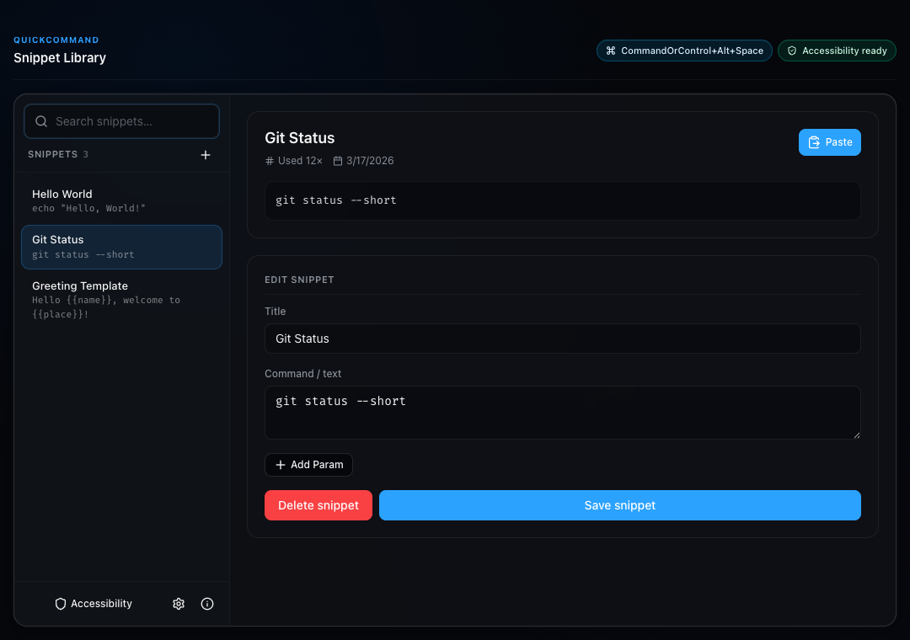
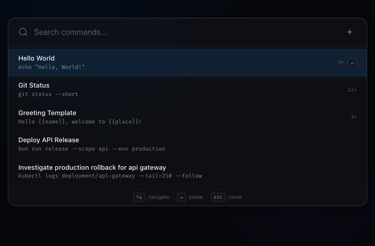
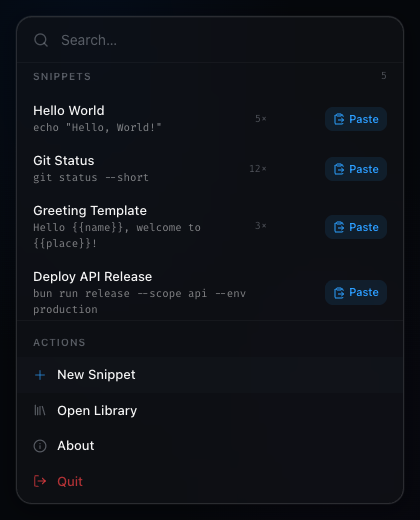

# QuickCommand

QuickCommand is a macOS menu bar app for people who reuse commands, prompts, replies, and text snippets all day. Save once, summon it instantly with a global shortcut, and paste into the app you are already using.

Built for fast hands-off insertion, QuickCommand combines a command palette, a compact menu bar popover, and a full snippet library in one local-first desktop app.

## Why QuickCommand

- **Stop retyping repeatable work**: keep shell commands, release notes, support replies, prompts, and templates one shortcut away.
- **Search feels immediate**: fuzzy matching is ranked by relevance, recency, and use count, so frequently used snippets rise to the top.
- **Paste into real apps, not just into QuickCommand**: the app hides, writes to the clipboard, triggers `Cmd+V`, then restores your clipboard contents.
- **Stay in your flow**: use the global shortcut for fast lookup, the menu bar for quick access, and the library window when you need full editing control.
- **Keep everything on your Mac**: snippets and settings are stored locally as JSON with import/export support.

## What You Get

- **Global command palette** for keyboard-first search and paste
- **Menu bar popover** for quick access without opening the full library
- **Snippet library window** with create, edit, delete, search, import, and export
- **Parameterized snippets** using placeholders like `{name}` and `{place}`
- **Onboarding flow** for Accessibility permission and shortcut setup
- **Customizable settings** for launch at login, startup behavior, and clipboard restore delay
- **Usage-aware search results** powered by fuzzy matching plus recency/use-count sorting
- **In-app update checks** that compare your version with GitHub Releases and open a manual download flow for unsigned macOS builds

## Screenshots

### Library Window



### Command Palette



### Menubar Popover



## Current Product Shape

QuickCommand currently ships as a macOS-only Electron app with four main surfaces:

- **Onboarding**: explains the app, requests Accessibility access, and lets you confirm the global shortcut.
- **Palette**: a centered search UI for fast snippet lookup and paste.
- **Library**: the main management window for your snippet collection.
- **Tray popover**: a compact, paged menu bar view for quick snippet access and common actions.

The default shortcut is `CommandOrControl+Alt+Space`, and it can be changed from the library settings panel.

## Best For

- Developers who repeat Git, Bun, Docker, Kubernetes, or deployment commands
- Operators who need incident-response snippets and production runbooks close at hand
- Support, sales, and ops teams who reuse replies and structured text
- Anyone who wants a local snippet launcher instead of a cloud workspace

## Requirements

- macOS M1 or later
- Accessibility permission for paste automation

## Tech Overview

### Core Dependencies

- **Electron 41 + React 19 + TypeScript** for the desktop UI
- **Bun** for package management, scripts, and tests
- **electron-vite** for main, preload, and renderer builds
- **Fuse.js** for fuzzy snippet search
- **Zod** for snippet/settings validation
- **Swift helper** for macOS Accessibility checks, settings deep links, and paste automation

### Development

```bash
# Install dependencies
bun install

# Start Electron in development mode
bun run dev

# Optional renderer-only browser preview
bun run dev:browser

# Run tests and type checks
bun test
bun run typecheck

# Build and package
bun run build
bun run build:helper
bun run package:dir
```

### Contribution Guide

If you contribute to QuickCommand:

- keep product-facing changes aligned with the current macOS app behavior
- run `bun test` and `bun run typecheck` before handing off changes
- use `bun run build:helper` when touching native paste automation or packaging flows
- update [README.md](README.md) and the root `screenshots/` folder when UI changes affect what users see
- prefer small, focused changes over broad refactors unless the task explicitly calls for them
